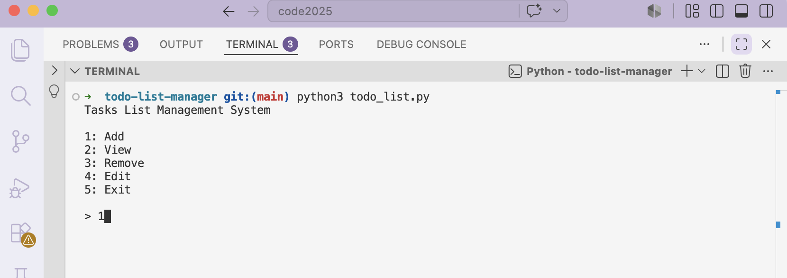
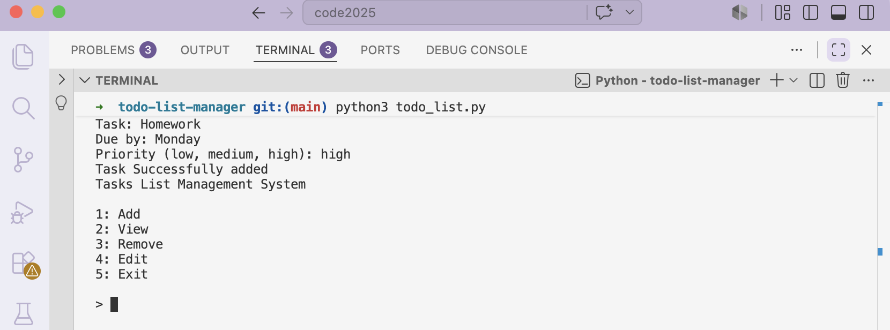
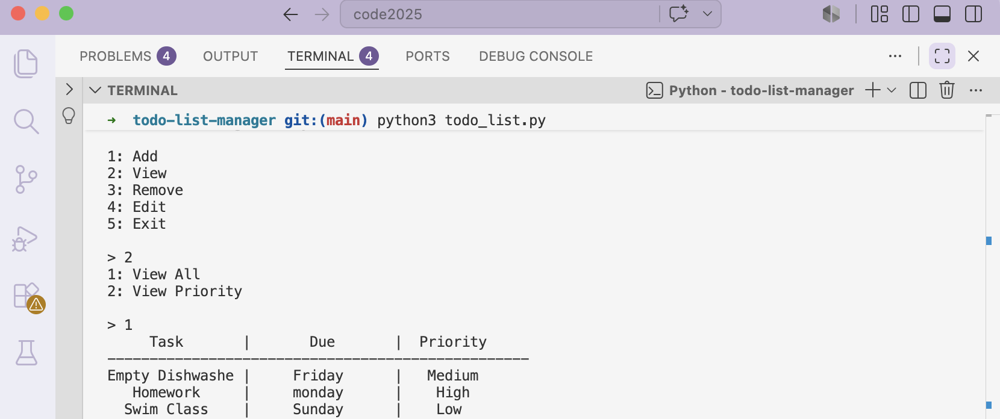
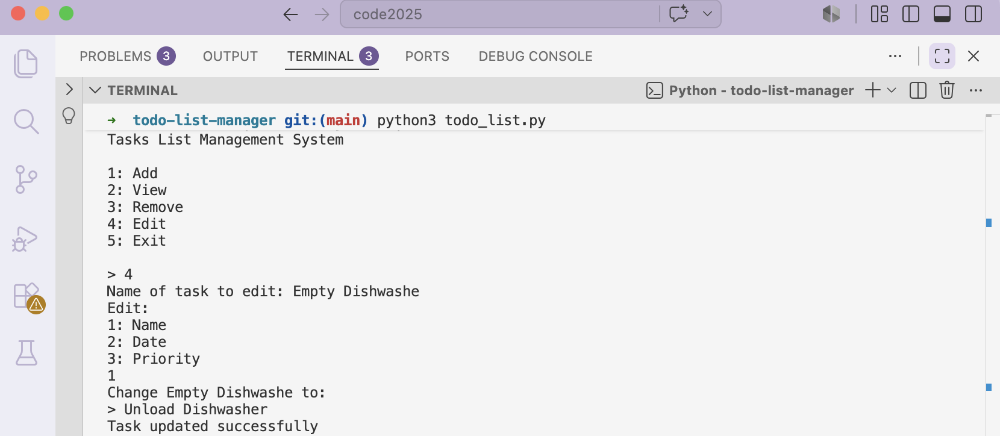
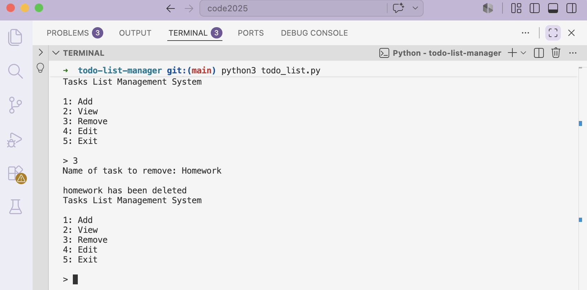

# Todo List Manager
A command-line task management application built with Python. Helps users stay organized and productive. Users can easily create, view, edit, and remove tasks while saving their information using JSON storage so tasks remain available after closing the program.

# Demo

### Main Menu


### Add Task


### View Tasks


### Edit Task


### Remove Task


## About This Project
I built this project to get more practice with Python. My goal was to build a complete application that saves data, validates user input, and organizes the code into reusable functions. Along the way, I refactored parts of the project to make the code cleaner and easier to maintain.

## Features
- Add task
- Edit existing task
- View all tasks
- Filter tasks by priority
- Remove tasks
- Save tasks using JSON
- Input validation
- Load saved tasks automatically

## What I Learned
This project helped me practice:
- Reading and writing JSON files to store and load data
- Building a CRUD (Create, Read, Update, Delete) application
- Working with lists and dictionaries to manage application data
- Creating reusable functions to organize code
- Handling user input and validating choices
- Refactoring existing code to make it cleaner and easier to maintain

## How To Run
1. Make sure Python 3 is installed
2. Open a terminal in the project folder
3. Run:
   
```bash
python todo_list.py
```

## Future Improvements
Some improvements I would like to add:
- Sort tasks by due date
- Mark tasks as completed
- Search for tasks by name
- Undo the last action (edit, delete, or add)
- Color-coded priorities
- Automatic backups
- Improve terminal interface
- Build a graphical user interface (GUI)

## Technologies Used:
- Python 3
- JSON
- Standard Library (json, os, time)

## Project Structure
```text
todo-list-manager/
├── README.md
├── images/
│   ├── add.png
│   ├── edit.png
│   ├── menu.png
│   ├── remove.png
│   └── view.png
├── tasks.json
└── todo_list.py
```
